# CraftManager — Руководство пользователя

## Содержание

1. [Начало работы](#1-начало-работы)
2. [Дашборд](#2-дашборд)
3. [Изделия](#3-изделия)
4. [Материалы](#4-материалы)
5. [Продажи](#5-продажи)
6. [Каналы продаж](#6-каналы-продаж)
7. [Подготовка к ярмарке](#7-подготовка-к-ярмарке)
8. [Расходы](#8-расходы)
9. [Настройки](#9-настройки)

---

## 1. Начало работы

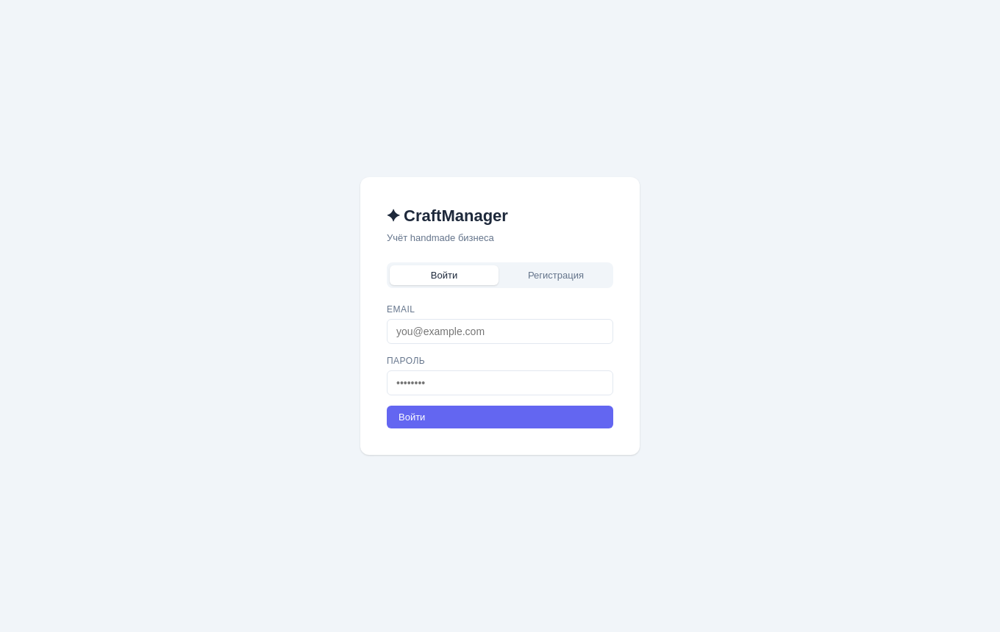

### Регистрация

Откройте приложение — вы попадёте на страницу входа. Нажмите **«Регистрация»**, введите email и пароль (минимум 6 символов), нажмите **«Зарегистрироваться»**.

После регистрации вы автоматически войдёте в систему.

### Вход

Введите email и пароль, нажмите **«Войти»**. Сессия сохраняется в браузере — при следующем открытии приложения авторизация не потребуется.

### Выход

Нажмите **«Выйти»** в нижней части левого меню.

### Навигация

Слева находится меню со всеми разделами. На мобильном устройстве меню открывается кнопкой **☰** в верхней части экрана.

### Разделы меню — коротко

Если непонятно, куда идти за нужной задачей — вот шпаргалка. Подробности по каждому разделу — в соответствующей главе ниже.

| Раздел | Зачем нужен | Что там можно делать |
|---|---|---|
| 📊 **Дашборд** | Быстро понять, как идут дела | Смотреть выручку, расходы и прибыль за период, топ продаваемых изделий, что заканчивается на складе |
| 🧸 **Изделия** | Каталог того, что вы делаете и продаёте | Заводить изделия, указывать цену и состав (из каких материалов и сколько), смотреть остаток и себестоимость |
| 🧵 **Материалы** | Склад сырья (пряжа, ткань, фурнитура и т.д.) | Заводить материалы, следить за остатком, пополнять запас при закупке |
| 💰 **Продажи** | Журнал того, что уже продано | Регистрировать продажу (что и сколько продали), остаток изделий на складе уменьшается автоматически |
| 🏪 **Каналы продаж** | Места, где вы продаёте | Заводить ярмарки, соцсети и другие каналы, смотреть, какой канал приносит больше выручки |
| 🎪 **Подготовка к ярмарке** | Сборы на конкретное мероприятие | Составить список «что взять» на выбранную ярмарку и увидеть, чего не хватает и сколько довязать |
| 📋 **Расходы** | Учёт трат бизнеса | Записывать расходы (аренда, реклама, инструменты и т.д.) — они попадают в расчёт прибыли на дашборде |
| ⚙️ **Настройки** | Подогнать приложение под себя | Валюта, списки категорий и единиц измерения, порог «мало на складе», экспорт/импорт всех данных |

---

## 2. Дашборд

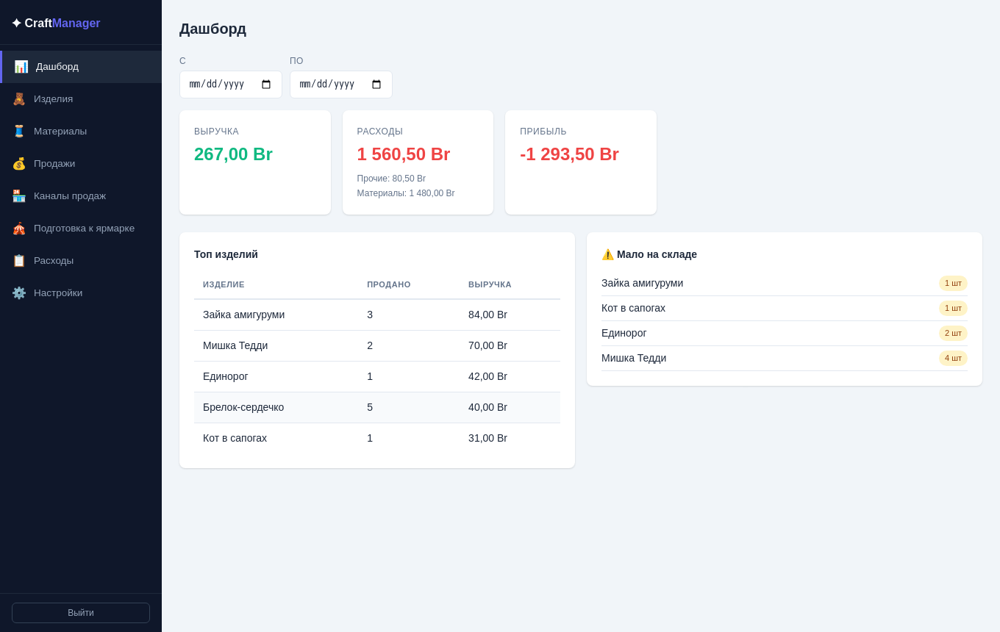

Главная страница показывает финансовую сводку за выбранный период.

### Фильтр по периоду

Используйте поля **«С»** и **«По»** для выбора дат. Все показатели пересчитываются мгновенно.

### Карточки KPI

| Карточка | Что показывает |
|----------|----------------|
| **Выручка** | Сумма всех продаж за период |
| **Расходы** | Сумма всех расходов за период |
| **Прибыль** | Выручка минус расходы |

Прибыль отображается зелёным цветом, если положительная, и красным — если отрицательная.

### Топ изделий

Таблица показывает до 10 изделий с наибольшей выручкой за период: название, количество проданных единиц и сумма выручки.

### «Мало на складе»

Список изделий, у которых остаток на складе меньше порогового значения (задаётся в Настройках, по умолчанию — 5 штук). Помогает вовремя пополнить запасы.

---

## 3. Изделия

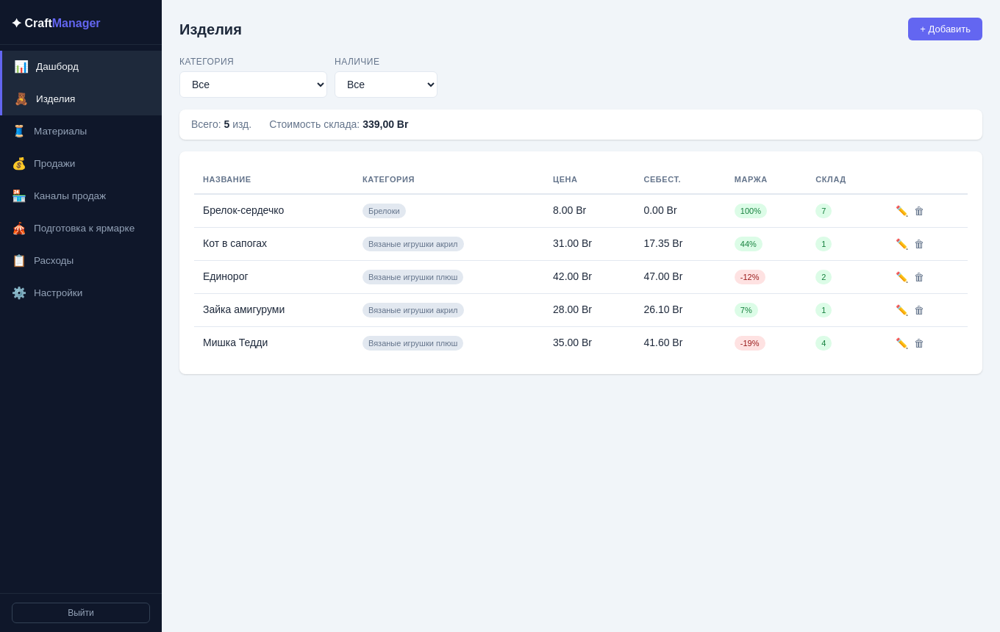

Раздел для учёта всех ваших товаров — игрушек, украшений, изделий ручной работы.

### Список изделий

В таблице отображаются:
- **Название** — клик по строке открывает карточку изделия
- **Категория** — тип изделия (задаются в Настройках)
- **Цена** — цена продажи
- **Себест.** — рассчитанная себестоимость на основе материалов
- **Маржа** — процент прибыли от цены продажи
- **Склад** — текущий остаток (зелёный — есть в наличии, красный — нет)

**Строка сводки** над таблицей показывает общее количество изделий и суммарную стоимость склада (остаток × цена продажи).

### Фильтры

- **Категория** — показать только определённую категорию
- **Наличие** — «В наличии» (stock > 0) или «Нет в наличии» (stock = 0)
- **Поиск** — по названию изделия, ищет по подстроке без учёта регистра

### Пагинация

Если изделий больше 20, внизу карточки появляются кнопки «← Назад» / «Вперёд →».

### Добавить изделие

Нажмите **«+ Добавить»**:

| Поле | Обязательное | Описание |
|------|:---:|---------|
| Название | ✓ | Название изделия |
| Категория | — | Выбор из списка в Настройках |
| Цена продажи | ✓ | Цена, по которой продаёте |
| Остаток | — | Количество на складе (по умолчанию 0) |
| Описание | — | Произвольное описание |

### Карточка изделия

Клик по строке в таблице открывает подробную страницу:

- Все данные изделия
- **Состав материалов** — список материалов с количеством и ценой за единицу
- Кнопка **«+ Добавить материал»** — добавить материал в состав (выбор из созданных вами материалов)
- Кнопка **«✕»** рядом с материалом — убрать его из состава

Себестоимость рассчитывается автоматически по формуле:  
`∑ (количество_материала × цена_за_единицу)`

### Пополнение остатка изделия

Кнопка **«Пополнить»** на карточке изделия открывает диалог:
- **Количество** — сколько добавляете к текущему остатку
- **Дата производства** — по умолчанию сегодня, можно указать другую

Ниже, в блоке **«История пополнений»**, показаны все партии производства этого изделия (дата, количество, источник — «Производство», «Восстановленная запись» или «Корректировка»), от новых к старым.

### Удаление изделия

Если у изделия нет продаж — оно удаляется физически. Если продажи есть — изделие вместо удаления архивируется: скрывается из активных списков и становится недоступно для новых продаж, пополнения и планов ярмарки, но история его продаж и производства сохраняется.

---

## 4. Материалы

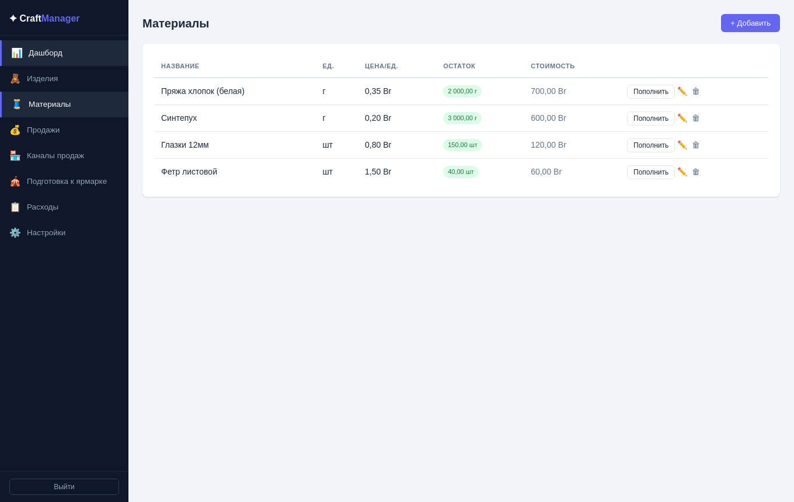

Раздел для учёта сырья и расходных материалов (пряжа, ткань, фурнитура и т.д.).

### Список материалов

Отображаются название, единица измерения, цена за единицу и текущий остаток.

### Добавить материал

Нажмите **«+ Добавить»**:

| Поле | Обязательное | Описание |
|------|:---:|---------|
| Название | ✓ | Название материала |
| Единица | ✓ | г, кг, м, мл, шт (список задаётся в Настройках) |
| Цена за ед. | ✓ | Стоимость одной единицы |
| Остаток | — | Текущее количество |

### Пополнение запасов

В строке материала нажмите кнопку **«+»** (пополнить). В диалоге:
- **Количество** — сколько добавляете к текущему остатку
- **Новая цена** — опционально, обновить цену за единицу (например, если купили по другой цене)

Пополнение прибавляется к существующему остатку.

---

## 5. Продажи

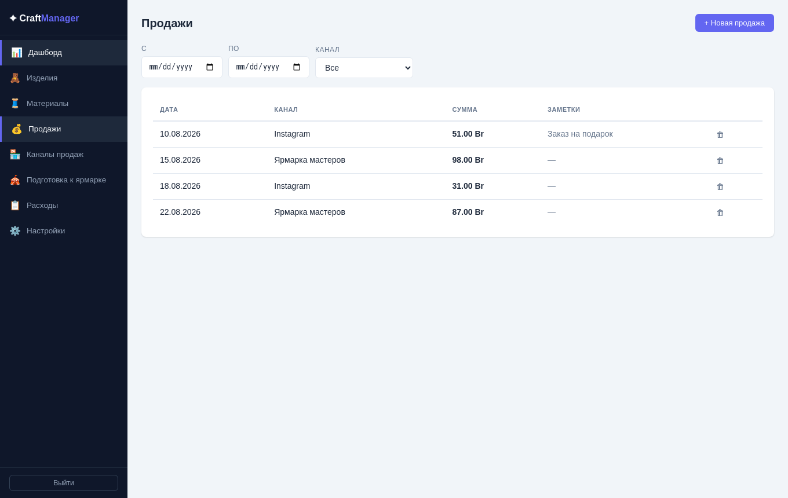

Раздел для регистрации всех продаж.

### Список продаж

Таблица показывает по одной строке на каждое проданное изделие: дата, канал продаж, изделие, количество, цена и сумма по позиции, заметки. Если в продаже несколько изделий — дата, канал и заметки повторяются в каждой строке, а строки одной продажи визуально сгруппированы. Клик по строке открывает карточку продажи целиком — с итоговой суммой и кнопкой удаления.

### Фильтры

- **С / По** — фильтр по дате продажи
- **Канал** — показать только продажи через определённый канал

### Создать продажу

Нажмите **«+ Новая продажа»**:

**Заголовок продажи:**
- **Дата** (обязательно) — дата совершения продажи
- **Канал продаж** — ярмарка, соцсети или другой канал (настраивается в разделе «Каналы продаж»)
- **Заметки** — произвольная пометка

**Позиции (что продали):**

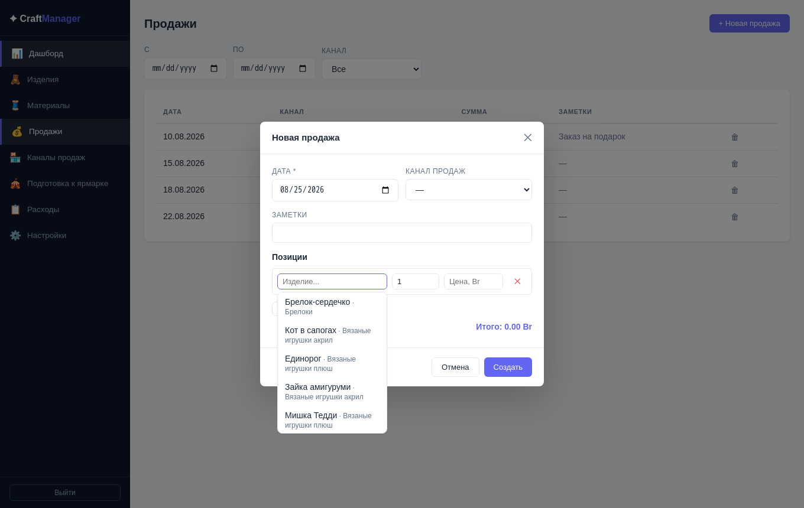

Нажмите **«+ Позиция»** для добавления товара:
- **Изделие** — начните вводить название в поле поиска; список показывает совпадения (или последние добавленные изделия, если поле пустое). Кликните нужное — цена подставится автоматически из карточки изделия, можно изменить. Кнопка **✎** рядом с выбранным названием — заменить изделие на другое. Позицию можно оставить без изделия (просто заполнить количество и цену вручную).
- **Кол-во** — количество штук
- **Цена** — цена продажи

Если для продажи уже выбран **канал** с сохранённым списком подготовки к ярмарке (раздел 7), поиск изделия сначала предлагает товары именно из этого списка — так быстрее найти нужное среди привезённого на ярмарку. Если нужного товара в списке нет — просто продолжите вводить название, через несколько символов поиск расширится на весь каталог. И наоборот: если сначала выбрать изделие, а канал ещё не указан, — канал подставится автоматически, если это изделие есть в чьём-то списке подготовки.

Можно добавить несколько позиций. **Итого** обновляется автоматически.

Нажмите **«Создать»** — продажа сохранится, а **остаток на складе** для каждого изделия автоматически уменьшится на проданное количество.

### Удаление продажи

Кликните по строке продажи, чтобы открыть карточку, и нажмите **🗑 Удалить** в её нижней части. Подтвердите — остатки товаров будут **восстановлены** автоматически.

---

## 6. Каналы продаж

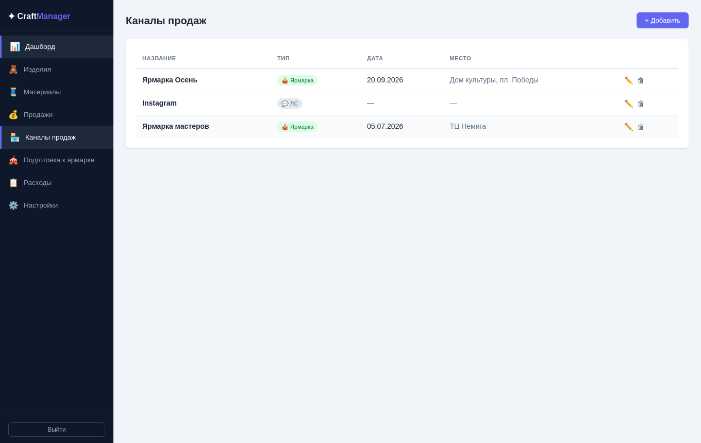

Каналы продаж — это места или способы, через которые вы продаёте изделия. Это помогает анализировать, какой канал приносит больше выручки.

### Типы каналов

| Тип | Описание |
|-----|----------|
| 🎪 **Ярмарка** | Офлайн-мероприятие. Можно указать дату и место проведения |
| 💬 **Личные сообщения** | Продажи через соцсети, мессенджеры |
| **Другое** | Любой другой канал |

### Добавить канал

Нажмите **«+ Добавить»**:

- **Название** (обязательно) — например, «Весенняя ярмарка 2026» или «Instagram»
- **Тип** — выберите из трёх вариантов
- Для ярмарки дополнительно: **Дата проведения** и **Место**
- **Заметки** — произвольная пометка

### Карточка канала

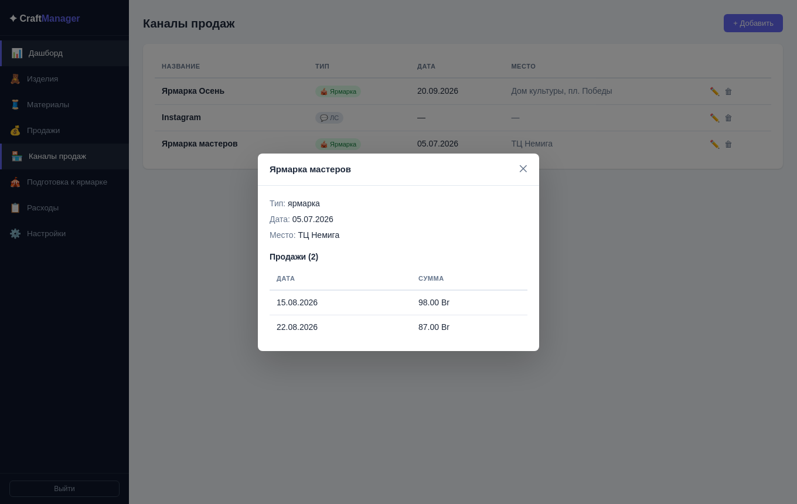

Клик по строке канала открывает его детали: тип, дата, место, заметки, а также **история продаж** через этот канал с датами и суммами.

---

## 7. Подготовка к ярмарке

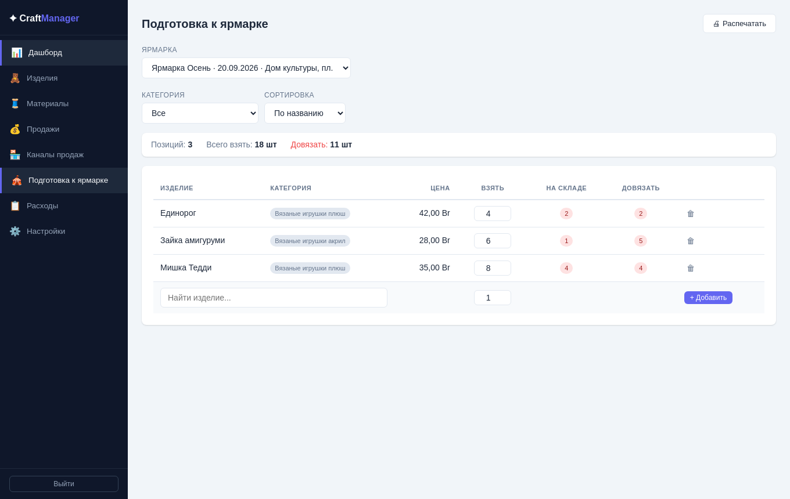

Раздел помогает собраться на конкретную ярмарку: заранее решить, что и сколько взять, и увидеть, чего не хватает на складе.

Работает только с каналами типа **«Ярмарка»** — если их ещё нет, сначала создайте такой канал в разделе «Каналы продаж».

### Как пользоваться

1. Вверху выберите ярмарку из списка.
2. В строке добавления начните вводить название изделия в поле поиска (или просто кликните в поле — покажутся последние добавленные изделия), выберите нужное из списка, укажите, сколько штук планируете взять, нажмите **«+ Добавить»**.
3. Повторите для всех изделий, которые собираетесь взять на ярмарку.

### Таблица

| Колонка | Что показывает |
|---|---|
| **Взять** | Сколько штук вы запланировали — можно менять прямо в таблице |
| **На складе** | Сколько сейчас есть в наличии (зелёным — хватает, красным — не хватает) |
| **Довязать** | Сколько ещё нужно доделать, чтобы набрать запланированное количество |

Сверху — сводка: сколько всего позиций, сколько штук нужно взять всего, и сколько ещё нужно довязать по всем изделиям сразу.

### Фильтр и сортировка

Можно отфильтровать список по категории изделий и отсортировать по названию, категории или цене — удобно, когда позиций много.

### Печать списка

Кнопка **«🖨 Распечатать»** открывает готовый список для печати — удобно взять с собой на сборы, не держа телефон под рукой.

Список не резервирует остатки и не списывает материалы — это просто планировщик «что взять», не более того.

---

## 8. Расходы

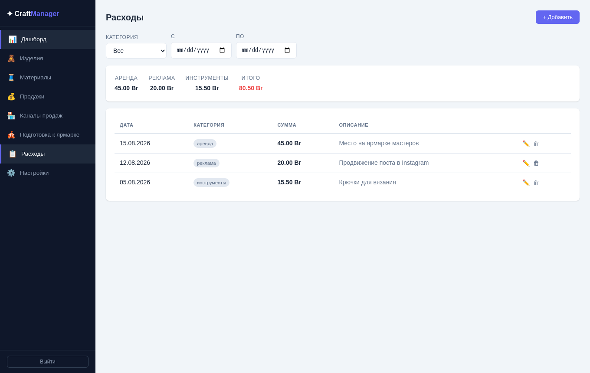

Раздел для учёта всех затрат бизнеса (материалы, аренда стенда на ярмарке, реклама, инструменты и т.д.).

### Список расходов

Отображаются дата, категория, сумма и описание.

### Фильтры

- **С / По** — фильтр по дате
- **Категория** — показать расходы определённой категории

### Добавить расход

Нажмите **«+ Добавить»**:

| Поле | Обязательное | Описание |
|------|:---:|---------|
| Дата | ✓ | Дата расхода |
| Сумма | ✓ | Сумма в вашей валюте |
| Категория | — | Выбор из списка в Настройках |
| Описание | — | Что именно куплено/оплачено |

Расходы учитываются в расчёте **Прибыли** на дашборде.

---

## 9. Настройки

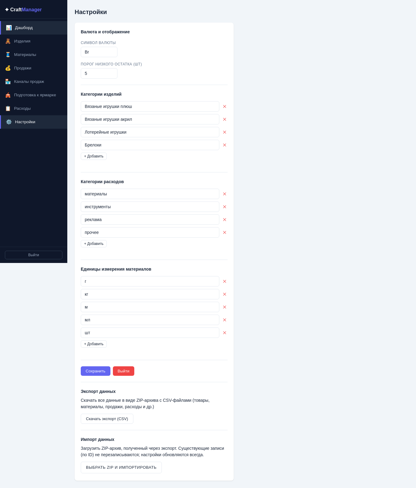

Раздел для персонализации приложения под ваш бизнес.

### Валюта

Укажите символ валюты (по умолчанию `Br`). Отображается рядом со всеми суммами в приложении.

### Категории изделий

Список категорий через запятую, например:  
`Вязаные игрушки плюш, Вязаные игрушки акрил, Брелоки`

Эти значения появляются в выпадающем списке при создании/редактировании изделия.

### Категории расходов

Список категорий расходов через запятую, например:  
`материалы, инструменты, реклама, аренда, прочее`

### Единицы измерения материалов

Список единиц через запятую, например:  
`г, кг, м, мл, шт`

### Порог низкого остатка

Число — если остаток изделия на складе **меньше или равно** этому значению, изделие попадает в блок «Мало на складе» на дашборде.

### Сохранение

Нажмите **«Сохранить»** после изменений. Настройки применяются ко всем разделам немедленно.

### Экспорт данных

Кнопка **«Скачать экспорт (CSV)»** сохраняет ZIP-архив со всеми вашими данными (изделия, материалы, продажи, расходы и т.д.) в виде CSV-файлов — удобно для резервной копии или переноса в другой аккаунт.

### Импорт данных

Кнопка **«Выбрать ZIP и импортировать»** загружает архив в том же формате, что создаёт экспорт. Уже существующие записи не перезаписываются — импорт только добавляет то, чего ещё нет. Исключение — настройки (валюта, категории и т.д.): они при импорте перезаписываются всегда.

---

## Частые вопросы

**Как рассчитывается себестоимость изделия?**  
Суммируются все материалы из состава: `количество × цена за единицу`. Цена берётся из текущей карточки материала. Если у изделия нет материалов — себестоимость не рассчитывается.

**Почему остаток уменьшился после продажи?**  
При создании продажи приложение автоматически списывает количество с остатка каждого изделия в позициях продажи. При удалении продажи остаток восстанавливается.

**Можно ли продать изделие, которого нет на складе?**  
Да, ограничений нет — остаток может стать отрицательным. Это сделано намеренно, чтобы не блокировать регистрацию продаж.

**Почему приложение долго загружается при первом открытии?**  
Сервер на Railway может «засыпать» при длительном отсутствии активности. Первый запрос «будит» его — это занимает 10–30 секунд. Последующие запросы работают быстро.

**Данные одного пользователя видны другому?**  
Нет. Все данные строго привязаны к вашему аккаунту и недоступны другим пользователям.
